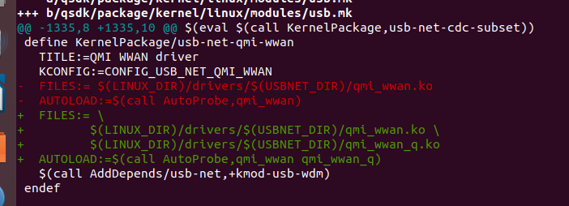
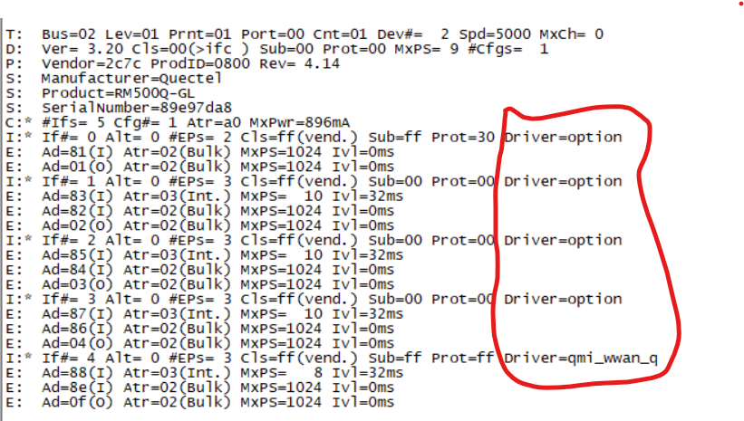
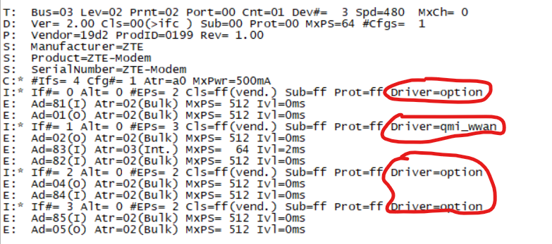

# IPQ40xx Platform

	调试板卡仿照高通IPQ40xx开发板进行设置，处理器使用IPQ4029，
	板卡功能包括WIFI（2.4G/5G频段）、5G模块、4G模块、GPS模块、GPIO控制（控制4G/5G/GPS模块电源、复位）、
	网口、SD卡和硬盘，固件存储使用NorFlash+NandFlash，当然也可以单独使用NorFlash用于存储固件。

## WIFI

	使用IPQ4029内嵌WIFI模块，支持2.4G和5G工作频段，运行需要支持对应驱动，
	并生成WIFI系统配置文件，可以用于使能/不使能对应频段。
	对应系统配置文件为/etc/config/wireless。

	问题：
	高通IPQ4029对WIFI晶振要求比较高，开始WIFI一直不正常无法搜索到对应SSID名字，更换高精度晶振后，无法正常。

	WIFI LED灯，在设备树中可以设置WIFI对应工作闪烁灯和信号强度灯。

## 5G

	调试使用Quectel 5G模块，通过操作手册可以进行驱动移植操作。
	需要将5G模块VID和PID添加到对应的USB转serial驱动文件option.c中，
	同时厂家把USB转NET驱动文件qmi_wwan_q.c开放给客户，可以直接与qmi_wwan.c文件共存。
	除更新Makefile添加对应qmi_wwan_q.c文件外，还需要更改对应usb.mk文件用于支持qmi_wwan_q驱动。

	更新版本后，可以通过以下命令查看模块支持驱动情况：
	cat /sys/kernel/debug/usb/devices

	之后可以通过AT命令来查看SIM信息，同时可以通过Quectel-CM拨号工具进行拨号上网。

## 4G

	需要在内核中支持USB转Serial和USB转NET驱动。
	需要系统支持对应4G模块时，需要将模块VID和PID添加到对应的USB转serial驱动文件option.c中
	和USB转NET驱动文件qmi_wwan.c中。
	通过对应模块AT命令手册我们可以通过AT命令获取对应模块信息或者拨号等功能。

	通过以下命令查看模块支持驱动情况：
	cat /sys/kernel/debug/usb/devices

## GPS

	GPS模块使用Quectel的L76模块，通信接口为串口，模块默认情况下波特率为9600bps。
	让系统使能microcom工具，用于读取GPS信息用于判断是否可以获取定位信息。
	通过标准数据串来解析是否成功定位。

## GPI0

	IPQ4029默认情况GPIO为输入模式并为低电平。
	可以通过命令行来实现GPIO操作。

## SD

	由于硬件同事在设计硬件原理时，没有连接CD插卡检测，导致系统查看SD的状态不对，导致无法将SD加载到系统中。
	通过将CD引脚激活状态改变后，更新版本后可以正常识别SD。

	我们这个使用的是TF，也叫做MicroSD。

